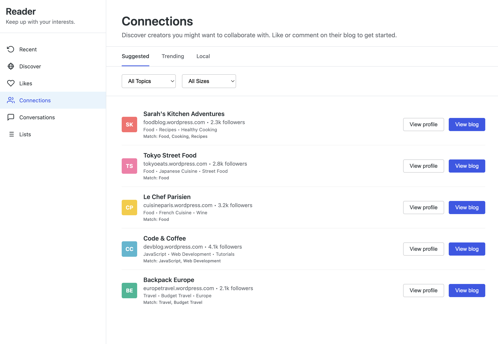
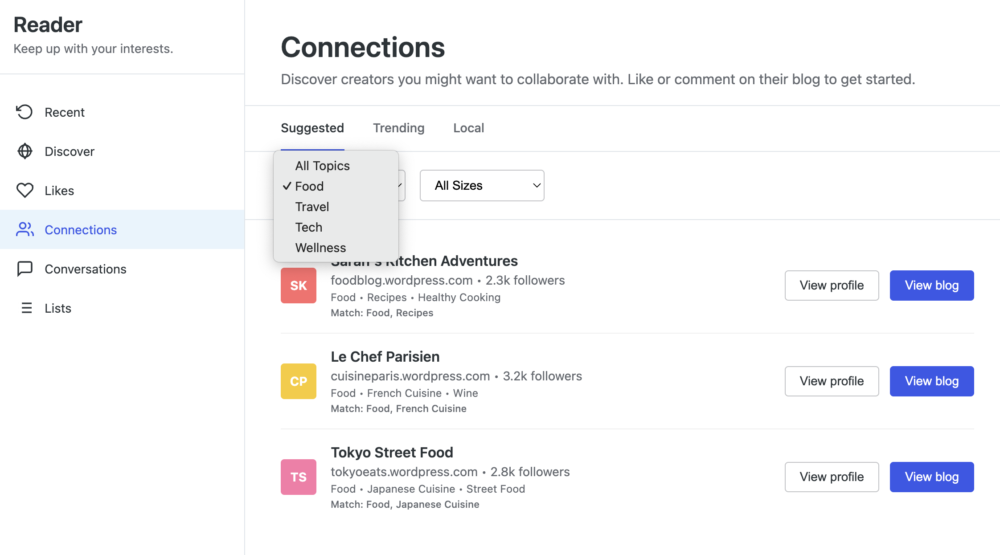
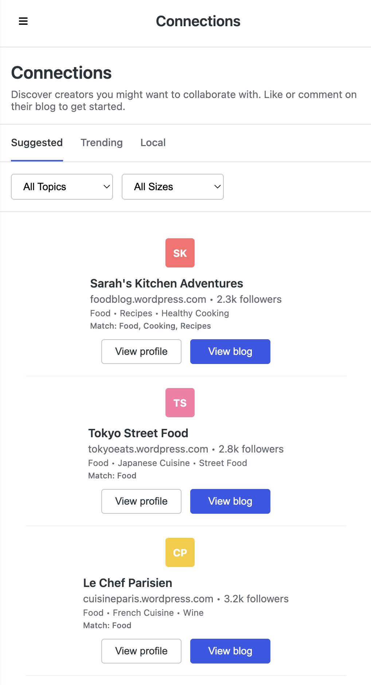
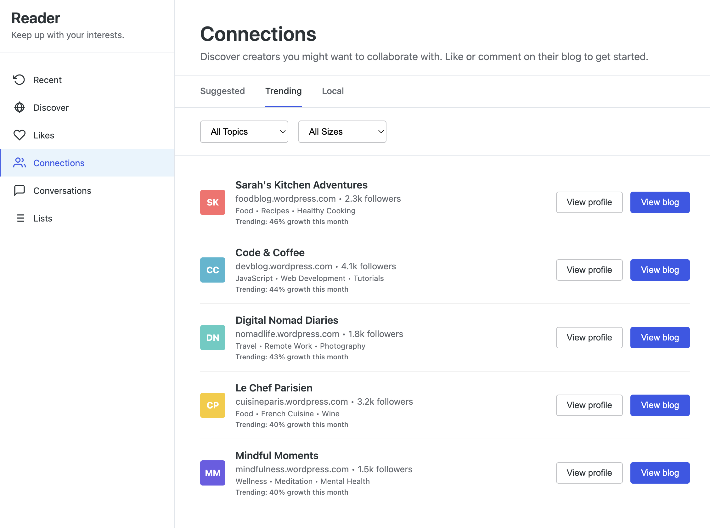
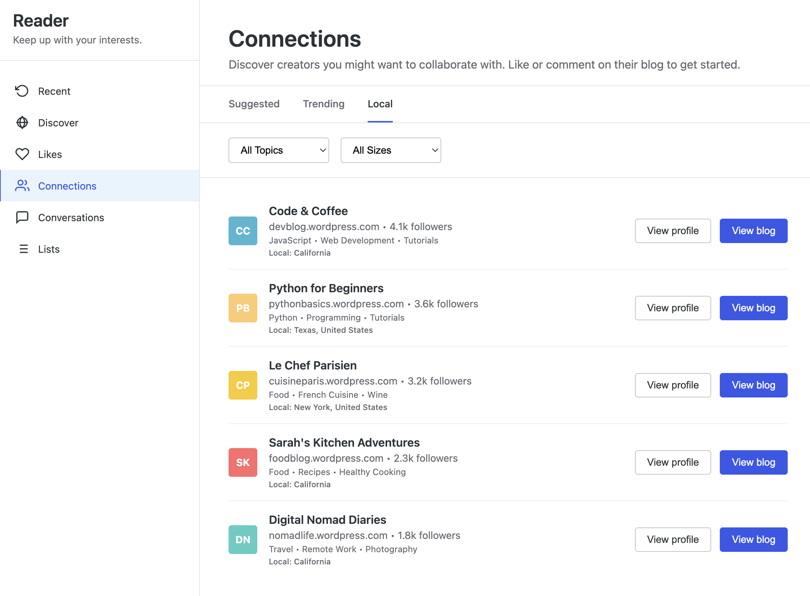

# WordPress.com Reader Connections

A matching tool for WordPress.com that helps creators discover and collaborate with other bloggers who share similar interests and locations.

## Screenshots

### Desktop Interface

*The main Connections interface showing smart creator matching based on topics*

### Smart Filtering

*Topic-based filtering - easily find creators by content type and size*

### Mobile Responsive Design

*Fully responsive design that works great on phones and tablets*

### Trending Creators

*Find fast-growing creators gaining momentum in the community*

### Local Discovery

*Discover creators in your region or country for local collaborations*

## Overview

The Connections feature adds a new tab to the WordPress.com Reader that intelligently suggests creators to connect with. People can discover trending creators, find local bloggers, and connect with others who share similar topics and engagement levels.

## Features

### 🎯 Smart Matching Algorithm
- **Topic similarity** - Matches creators based on shared interests and content themes
- **Language compatibility** - Ensures creators can communicate effectively  
- **Engagement scoring** - Pairs active creators with other engaged community members
- **Geographic proximity** - Considers location for local collaboration opportunities

### 📱 Three Discovery Modes
- **Suggested** - Personalized recommendations based on your content and engagement
- **Trending** - Fast-growing creators gaining momentum in the community
- **Local** - Creators in your region/country for local collaborations

### 🔍 Filtering & Search
- Filter by content topics (Food, Travel, Tech, Wellness, etc.)
- Filter by creator size (Small, Medium, Large following)
- Responsive design that works on desktop, tablet, and mobile

### 🌍 Global Support
- Multi-language creator matching
- Regional hierarchy (state/province → country → global)
- Diverse creator database representing global WordPress.com community

## How It Works

### For Users
1. **Discover** - Browse suggested creators in the new Connections tab
2. **Evaluate** - See compatibility reasons and creator details
3. **Engage** - Visit their blog or Reader profile to start building relationships
4. **Collaborate** - Natural progression from engagement to partnership

### For the Platform
1. **Data Collection** - Analyzes user topics, engagement patterns, and location
2. **Matching Engine** - Runs algorithm to score creator compatibility
3. **Content Curation** - Presents top matches with clear reasoning
4. **Privacy-First** - No direct messaging - encourages organic blog engagement

## Technical Architecture

### Frontend Components
```
├── Interface Layer (HTML/CSS)
│   ├── WordPress.com Reader styling
│   ├── Mobile responsive design
│   └── Accessibility compliance
├── Interaction Layer (JavaScript)
│   ├── Tab switching logic
│   ├── Filter functionality
│   └── Mobile menu handling
└── Data Layer
    ├── Creator profiles
    ├── Matching algorithm
    └── User preferences
```

### Matching Algorithm Logic

The recommendation engine uses a weighted scoring system:

```javascript
// Scoring factors (out of 100 points total)
Topic Similarity:     40 points per matching topic
Language Match:       30 points (essential)
Engagement Compat:    20 points (based on activity levels)
Creator Size Bonus:   10 points (mid-size creators favored)
```

**Filtering Process:**
1. Remove creators below 30% compatibility threshold
2. Sort by match score (highest first)
3. Return top 5 recommendations
4. Apply user-selected filters

### Data Structure

```javascript
// Creator Profile Schema
{
  name: "Creator Display Name",
  url: "blog.wordpress.com", 
  username: "wordpress-username",
  followers: 2500,
  topics: ["Food", "Recipes", "Healthy Living"],
  language: "English",
  engagementScore: 85, // 0-100 activity level
  location: {
    region: "California", 
    country: "United States"
  },
  avatar: {
    color: "#ff6b6b",
    initials: "SK"
  }
}
```

## Installation

### Development Setup
1. Clone the repository
2. Open `reader-connections.html` in a web browser
3. Resize window to test responsive behavior
4. Use browser dev tools to simulate mobile devices

### Integration with WordPress.com
*Note: This is currently a prototype. Production integration requires:*

- PHP conversion of JavaScript logic
- WordPress.com API integration for user data
- Database schema for creator profiles and matching cache
- Admin interface for managing recommendations

## File Structure

```
├── reader-connections.html    # Main prototype file
├── README.md                 # This documentation
├── CONTRIBUTING.md           # Contributor guidelines
├── ARCHITECTURE.md           # Technical deep-dive
└── screenshots/              # Demo images and mockups
```

## Configuration

### Customizing the Matching Algorithm

Edit the `findMatches()` function to adjust scoring weights:

```javascript
// Topic similarity weight (default: 40 points per match)
score += commonTopics.length * 40;

// Language requirement (default: 30 points)
if (creator.language === user.language) {
    score += 30;
}

// Engagement compatibility (default: 20 point max)
const engagementDiff = Math.abs(creator.engagementScore - user.engagementScore);
score += Math.max(0, 20 - engagementDiff * 0.5);
```

### Adding New Topics

Update the topic filter options:

```html
<select id="topicFilter">
    <option value="">All Topics</option>
    <option value="Food">Food</option>
    <option value="Travel">Travel</option>
    <option value="YourNewTopic">Your New Topic</option>
</select>
```

### Creator Size Thresholds

Modify the size filter logic:

```javascript
if (sizeFilter === 'small') return c.followers < 2000;
if (sizeFilter === 'medium') return c.followers >= 2000 && c.followers <= 5000;
if (sizeFilter === 'large') return c.followers > 5000;
```

## Privacy & Ethics

### User Privacy
- **No direct messaging** - Prevents spam and unwanted contact
- **Public engagement only** - Users connect through blog comments/likes
- **Opt-in discovery** - Users control their visibility in recommendations
- **Data minimization** - Only uses publicly available profile information

### Algorithmic Fairness  
- **Diverse representation** - Algorithm doesn't favor large creators over small ones
- **Global inclusion** - Supports creators from all countries and languages
- **Engagement equity** - Values authentic engagement over follower count
- **Topic diversity** - Prevents echo chambers by suggesting complementary topics

## Browser Support

- **Desktop:** Chrome 90+, Firefox 88+, Safari 14+, Edge 90+
- **Mobile:** iOS Safari 14+, Chrome Mobile 90+, Samsung Internet 14+
- **Features:** CSS Grid, Flexbox, ES6 JavaScript, responsive design

## Contributing

We welcome contributions! Please see [CONTRIBUTING.md](CONTRIBUTING.md) for guidelines.

### Development Workflow
1. Fork the repository
2. Create a feature branch (`git checkout -b feature/amazing-feature`)
3. Make your changes
4. Test on multiple devices/browsers
5. Commit with clear messages (`git commit -m 'Add amazing feature'`)
6. Push to your fork (`git push origin feature/amazing-feature`)
7. Open a Pull Request

### What We're Looking For
- UI/UX improvements
- Algorithm refinements
- Accessibility enhancements
- Performance optimizations
- Mobile experience improvements
- Internationalization support

## Roadmap

### Phase 1: Production Integration
- [ ] Convert JavaScript to PHP classes
- [ ] WordPress.com API integration
- [ ] Database schema design
- [ ] Admin configuration interface

### Phase 2: Enhanced Matching
- [ ] Machine learning recommendations
- [ ] Content analysis integration
- [ ] Seasonal/trending topic detection
- [ ] Collaboration success tracking

### Phase 3: Advanced Features
- [ ] Creator partnership proposals
- [ ] Collaboration templates
- [ ] Success metrics dashboard
- [ ] Community events integration

## License

This project is licensed under the MIT License - see the [LICENSE](LICENSE) file for details.

## Support

For questions about this prototype:
- Open an issue in this repository
- Contact the WordPress.com Creator Experience team
- Join the #creators-maison Slack channel

## Acknowledgments

- WordPress.com Design System for UI components
- Creator Maison team for product requirements
- WordPress.com community for inspiration and feedback

---

**Built for WordPress.com Creators Maison**  
*Connecting creators, building community, fostering collaboration*
